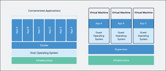

# Docker

1. [Introducción](#id1)
2. [Red](#id2)
3. [Almacenamiento](#id3)
4. [Imagenes](#id4)
5. [Instalación](#id5)
6. [Docker Compose](#id6)
7. [Dockerfile](#id7)
8. [Comandos](#id8)
## Introducción<a name="id1"></a> 

Docker es un proyecto de código abierto que automatiza el despliegue de aplicaciones dentro de contenedores de software, proporciona una capa de abstraccción y automatización de virtualización de aplicaciones en múltiples sistemas operativos.



**Contenedores:** 
* Def1. Unidad de software que empaqueta el código y todas las dependencias necesarias de una aplicación
* Def2. Es otra capa adicional de donde van a ejecutar las capas de imagenes, es decir, donde van a correr nuestras imagenes.

Los contenedores tiempre tienen estados asignados y los estados disponibles son:
 * Created
 * restarting
 * running
 * removing
 * paused
 * exited
 * dead 

El ciclo de vida es temportal, de lectura y escritura. Cuando se elimina un contenedor se elimina toda la información almacenada en el contenedor.

**Imágenes:** Paquete ligero y ejecutable de software con todo lo necesario para la aplicación

**Docker Engine:** Motor de ejecución de contenedores.

**Docker Hub:** Repositorio por defecto para las imágenes de docker

**Docker Compose:** Orquestador ligero de contenedores.

**Docker Swarm:** Orquestador de contenedores que permite manejar un cluster.

**Kubernetes:** Sistema para la administración de clusters y Orquestador Empresarial de contenedores.

### <u>**Arquitectura y Componentes**</u>
**DockerHost:** Es la máquina donde va a correr docker

**DockerCLI:** Es el cliente con el que a través de comandos vamos a administrar docker

**RetAPI:** Es una api para poder administrar docker mediante peticiones Get o Post porejemplo docker ps es Get/ container/JSON,ideal para Jenkins

**Docker Daemon:** Es el demonio que presta el servicio de docker, "el servidor"

## Red<a name="id2"></a> 

Tipo de conexión entre contenedores y el resto del mundo. Hay 5 tipos de drivers.

* **Bridge:** Es el driver por defecto, se utiliza para comunicar contenedores en el mismo docker host. La puerta de enlace de esta red es la interfaz docker que se crea en la instalación de docker.

* **Overlay:** Es el driver que se utiliza para conectarme con otros contenedores en otro docker hub.


## Almacenamiento<a name="id3"></a> 
Se utilizan para persistir los datos de un contenedor, existen 3 tipos.

1. Tipo Host

Se mapeará  un directorio del docker host al directorio donde la operación guarda los datos en el contenedor.
De este modo cualquier información que la aplicación guarde en el directorio del contenedor también se guardará en el docker host.

Este volúmen no se borra con el comando: **docker rm -fv mi_contenedor**
Creamos un directorio al cual querramos mapear.

mkdir nginxconf

Creamos un contenedor con ngix y copiamos /etc/ngix/engix.conf al directorio creado. -> Unicamente para tener el archivo de configuración de ngix a mano.

-> Luego con el comando siguiente mapeamos el directorio al nuevo contenedor.

docker run -d --name nginx-volume -v $pwd/nginx.conf/nginx.conf:/etc/ngix/nginx.conf nginx

2. Volúmenes anomimos

Este volúmen es creado y manejado por docker, la información se guarda en un directorio que crea docker en el docker root Dir con un nombre aleatorio

Docker root dir: docker info | grep -i root

-> Estos volúmenes no se recomiendan no son seguros ya que se puede perder la información.

3. Volúmenes nombrados
Este tipo de volúmen es una mezcla entre un volúmen de host y un volúmen anónimo, lo creamos con el comando docker volume create y se guarda en docker root dir

-> Este tipo de volúmen no se borra

Para crear volúmenes:

docker run -d --name jenkins-vol-nombrado -p 8080:8080 -p 5000:5000 -v jenkins_home:/var/jenkins_home

Vemos si se creo el volumen donde estan los directorios.
ls -lrt/var/lib/docker/volumes

## Imagenes<a name="id4"></a> 

Una imagen es una plantilla creada a partir de una serie de instrucciones para luego crear contenedores en base a esta. Para crear imagenes vamos a crear un archivo llamado Dockerfile


## Instalación<a name="id5"></a> 
~~~

#sudo apt-get update

#sudo apt-get install 
    ca-certificates \
    curl \
    gnupg \
    lsb-release

#sudo mkdir -p /etc/apt/keyrings

#curl -fsSL https://download.docker.com/linux/debian/gpg | sudo gpg --dearmor -o /etc/apt/keyrings/docker.gpg

#echo \
  "deb [arch=$(dpkg --print-architecture) signed-by=/etc/apt/keyrings/docker.gpg] https://download.docker.com/linux/debian \
  $(lsb_release -cs) stable" | sudo tee /etc/apt/sources.list.d/docker.list > /dev/null

#sudo apt-get update

# apt-get install docker-ce docker-ce-cli containerd.io docker-compose-plugin

#docker version
~~~

Luego de instalado agregamos al los usuarios que querramos al grupo Docker con el comando: **usermod -aG docker ${USER}**

## Docker Compose<a name="id6"></a> 

* Instalación
apt-get install docker-compose-plugin="Distro"

Ejemplo:
``` 
version: '3.1'

services:

  db:
    container_name: postgres 
    image: postgres
    restart: always
    ports:
      - 5432:5432
    environment:
      POSTGRES_USER: postgres
      POSTGRES_PASSWORD: qwerty
      POSTGRES_DB: postgres

  adminer:
    container_name: adminer
    image: adminer
    restart: always
    depends_on:
      - db
    ports:
      - 9090:8080
``` 
Si queremos ejecutar el archivo levantando las imagenes es con la opción up -d al final.

**docker compose -f  postgres.yml up -d**


## Dockerfile<a name="id7"></a>

Es un documento de texto que contiene todos los comandos que vamos a ejecutar a la hora de crear nuestra imagen. Se podría decir que nuestro dockerfile va a ser la receta que docker va a seguir para poder crear nuestra imagen.

* El comando **FROM** nos va a servir para basar nuestra imagen en una imagen ya existenete. Este comando siempbre tienen que ser el primero en nuestro dockerfile.

        Ej: FROM node:11


* El comando **RUN** nos va a servir para correr comandos en una terminal dentro de nuestro container. Esto es util para cambiar configuración a nivel de sistema operarivo o bien instalar paquetes de forma global.

        RUN npm install -g pm2 --silent

* El mando **CMD** nos va a servir para indicarle a nuestra imagen que comando tiene que correr por defecto para crear nuestro contenedor. En caso de que nuestro comando contenga parámetros hay que escribir el comando en formato de array[]

        CMD ["node". "server.js"]

* El comando **EXPOSE** nos va a servir para indicarle a nuestro container que puerto escuchar muentras esté corriendo. Esto es especialmente útil para cuando estamos corriendo un servidor

        EXPOSE 3000

* El comando **WORKDIR** nos va a serviro para indicarle a nuestra imagen que directorio tiene que usar como base para los comandos que modifiquen el sistema de archivos. En caso de que no exista el directorio indicado, docker lo va a crear.

        WORKDIR /usr/src/app

* El comando **COPY** nos va a servir para copiar archivos desde nuestra computadora a nuestra imagen de Docker. Con el mando COPY podemos copiar archivos o directorios completos.

        COPY test.txt .

        COPY ..

El comando ENV nos va a servir para crear variables de ambiente dentro de nuestra imagen. Por ejemplo para indicarle si estamos en el ambiente de testing o producción

    ENV NODE_ENV production

Ejemplo de Dockerfile

    #Buscamos la imagen de node version 10.15
    FROM node:10.15-alpine

    #Establecemos una carpeta de trabajo
    WORKDIR /usr/src/app

    #Copiamos todos los archivos
    COPY ..

    #Ejecutamos el comando de npm build
    RUN npm run build

    #Exponemos el puerto 3001
    EXPOSE 3001

    #Corremos nuestra imagen con el comando start
    CMD ["nmp", "start"]

## Comandos<a name="id8"></a> 
### **docker ps**
        El comando docker ps nos sirve para listar todos los contenedores que se estan corriendo actualmente

        En el caso de ver los contenedores que ya terminaron o murieron en el pasado, podemos correr el comando docker ps -a

### **docker build**

        El comando docker build nos sirve para crear una imagen en base a un archivo Dockerfile

### **docker images**

        El comando docker images nos sirve para listar todas las imágenes que creamos.

### **docker run**

        El comando docker run nos sirve para crear un contenedor a partir de una imagen

        Ej: docker run -p PUERTO_EXPOSE:SERVIDOR image_id
        Ej: docker run -p 8080:8080 056534324ew43

### **docker start**
        Podemos iniciar un contenedor terminado con todos sus cambios anteriores intactos. Podemos ver que el contenedor está iniciado con el comando docker ps
        Podemos iniciar un contenedor con el flag -a, el cual iniciará en modo adjunto, lo cual veremos logs del contenedor.
        
### **docker attach**       
        Con docker attach nos podemos adjuntar al contenedor y todos los comandos recíbidos en el se van a motrar en pantalla.

### **docker logs**  
        Podemos ver los logs pasados del contenedor, con el flag -f vamos a posicionarnos en la terminal donde podemos ver logs futuros además de los pasados.
### <u>Otros comandos:</u>
### **docker system prune**

### **docker volume ls**

### **docker volume prune**

### **docker-compose up -d**

### **docker-compose down**

### **docker images rmi imagen**

### **docker images -a**

### **comando para ver información de tarjetas de red**
docker inspect -f '{{range.NetworkSettings.Networks}} {{. IPAddress}} {{end}}' name_or_id


## Uso para aplicaciones pequeñas

        Para utilizar docker con aplicacions pequeñas como por ejemplo la app3, vemos que podemos crear el archivo Dockerfile,
        para luego instalar pyhton y enviar los archivos necesarios para ejecutar la aplicación.
        Los comandos para ejecutar la aplicación son los siguientes:
        docker run -it <image-id>
        Una vez terminada la aplicación podemos ejecutarla nuevamente con: 
        docker start -a -i <conteiner-id>

Dockerfile:
``` 
FROM python

WORKDIR /app

COPY . /app

CMD ["python", "main.py"]
``` 